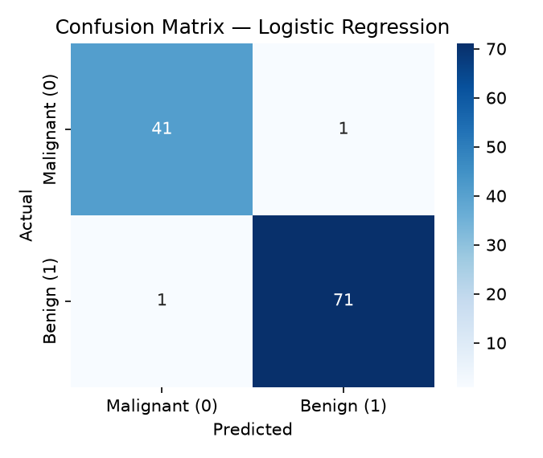
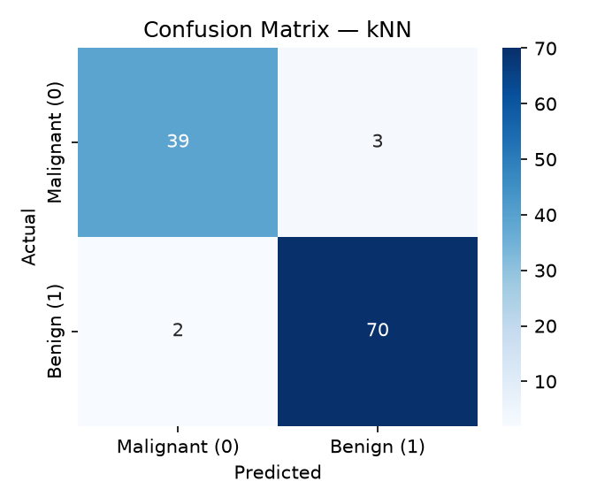
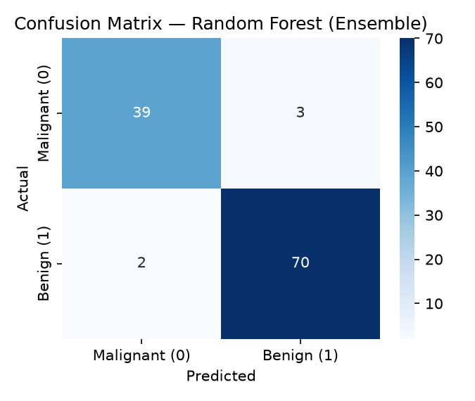
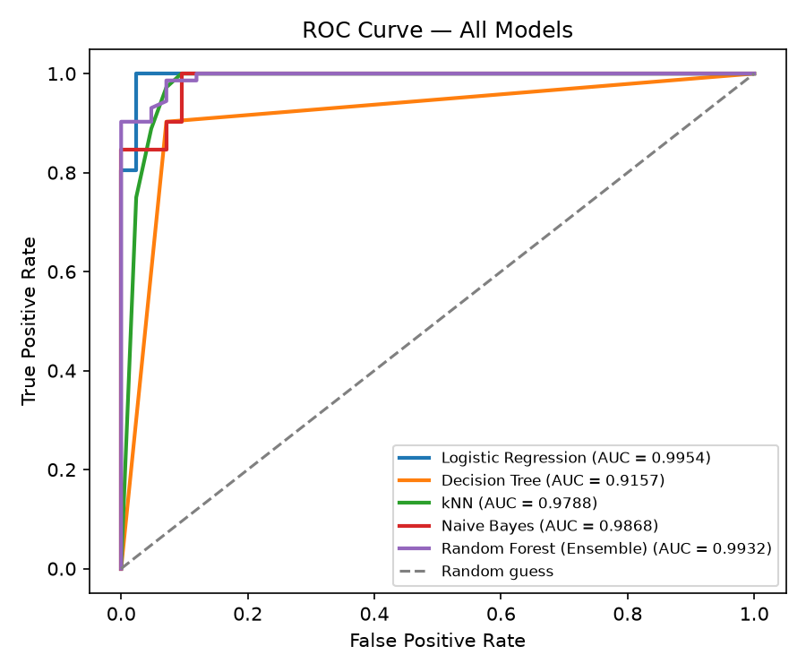
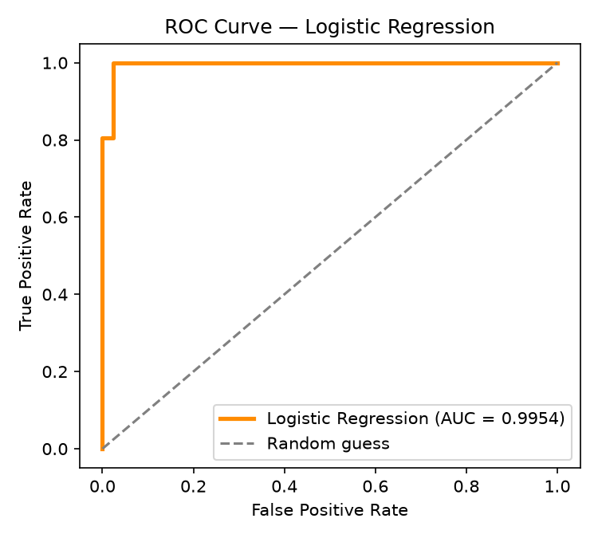
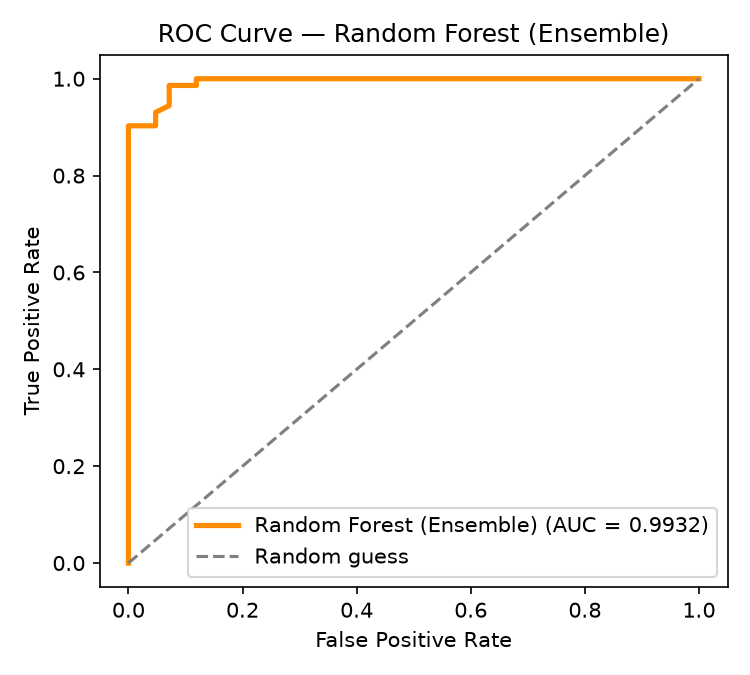

# Breast Cancer Classification — ML Assignment 2

## a. Problem Statement
Breast cancer is one of the most common cancers, and early, accurate diagnosis
significantly improves patient outcomes. This project builds and compares five
machine learning classifiers to predict whether a breast tumor is **malignant**
or **benign** based on numeric features computed from digitized images of a
fine needle aspirate (FNA) of a breast mass. The goal is to identify the model
that best distinguishes malignant from benign cases, and to deploy an
interactive Streamlit app so that predictions and evaluation metrics can be
explored on held-out test data.

## b. Dataset Description
**Dataset:** Breast Cancer Wisconsin (Diagnostic) Data Set
**Source:** UCI Machine Learning Repository (also bundled in `sklearn.datasets`
as `load_breast_cancer`, which is the exact same UCI dataset)

- **Instances:** 569
- **Features:** 30 numeric features (mean, standard error, and "worst"/largest
  value of 10 real-valued measurements per cell nucleus, e.g. radius, texture,
  perimeter, area, smoothness, compactness, concavity, concave points,
  symmetry, fractal dimension)
- **Target:** Binary — `0 = malignant`, `1 = benign`
- **Class balance:** 212 malignant / 357 benign

This satisfies the assignment's minimum requirements of ≥12 features and ≥500
instances.

## c. GitHub Repository Link
`<PASTE-YOUR-GITHUB-REPO-LINK-HERE>`

Repository structure:
```
project-folder/
│-- app.py
│-- requirements.txt
│-- README.md
│-- test_data.csv
│-- model/
│   │-- train_models.py
│   │-- logistic_regression.pkl
│   │-- decision_tree.pkl
│   │-- knn.pkl
│   │-- naive_bayes.pkl
│   │-- random_forest.pkl
│   │-- scaler.pkl
│   │-- feature_names.pkl
│   │-- comparison_table.csv
│   │-- reports/
│   │   │-- confusion_matrix_logistic_regression.png
│   │   │-- confusion_matrix_decision_tree.png
│   │   │-- confusion_matrix_knn.png
│   │   │-- confusion_matrix_naive_bayes.png
│   │   │-- confusion_matrix_random_forest.png
│   │   │-- classification_report_logistic_regression.txt
│   │   │-- classification_report_decision_tree.txt
│   │   │-- classification_report_knn.txt
│   │   │-- classification_report_naive_bayes.txt
│   │   │-- classification_report_random_forest.txt
│   │   │-- roc_curve_all_models.png
│   │   │-- roc_curve_logistic_regression.png
│   │   │-- roc_curve_random_forest.png
```

## d. Models Used

All 5 models were trained on an 80/20 stratified train-test split
(`random_state=42`) of the same dataset, with features standardized using
`StandardScaler` (fit on the training set only).

### Comparison Table

| ML Model Name              | Accuracy | AUC    | Precision | Recall | F1     | MCC    |
|-----------------------------|----------|--------|-----------|--------|--------|--------|
| Logistic Regression         | 0.9825   | 0.9954 | 0.9861    | 0.9861 | 0.9861 | 0.9623 |
| Decision Tree                | 0.9123   | 0.9157 | 0.9559    | 0.9028 | 0.9286 | 0.8174 |
| kNN                          | 0.9561   | 0.9788 | 0.9589    | 0.9722 | 0.9655 | 0.9054 |
| Naive Bayes                  | 0.9298   | 0.9868 | 0.9444    | 0.9444 | 0.9444 | 0.8492 |
| Random Forest (Ensemble)     | 0.9561   | 0.9932 | 0.9589    | 0.9722 | 0.9655 | 0.9054 |

### Observations

| ML Model Name              | Observation about model performance |
|-----------------------------|--------------------------------------|
| Logistic Regression         | Best performer across every metric. The classes are close to linearly separable after standardization, and with only 569 samples and 30 features, the low-variance linear model generalizes better than more flexible models. |
| Decision Tree                | Weakest performer. A single unpruned tree overfits the training data, so it captures noise and does not generalize as well as the ensemble or linear methods — reflected in its lower AUC and MCC. |
| kNN                          | Solid, well-balanced performance. Because features were scaled first, distance-based neighbor voting works well, but it slightly trails Logistic Regression, likely due to sensitivity to local noise near the class boundary. |
| Naive Bayes                  | Decent accuracy but the lowest precision/recall balance among the top models. Its independence assumption between the 30 (often correlated) features is violated in this dataset, which limits its ceiling despite a strong AUC. |
| Random Forest (Ensemble)     | Strong and stable performance, essentially tying kNN and closely trailing Logistic Regression. Averaging many trees reduces the overfitting seen in the single Decision Tree and yields a high AUC, showing the benefit of ensembling. |
| **Overall Winner for your dataset** | **Logistic Regression** — it achieved the highest score on every single metric (Accuracy, AUC, Precision, Recall, F1, MCC), indicating the decision boundary for this dataset is close to linear once features are standardized. |

## Confusion Matrix — Each Model

**Logistic Regression**


**Decision Tree**


**kNN**


**Naive Bayes**


**Random Forest (Ensemble)**


## ROC Curve

**All 5 models compared**


**Logistic Regression (highlighted)**


**Random Forest / Ensemble (highlighted)**


Logistic Regression and Random Forest post the two highest AUC scores
(0.9954 and 0.9932 respectively) and their ROC curves sit closest to the
top-left corner, confirming both models separate the two classes with very
few false positives/negatives across almost all classification thresholds.

## Classification Report — Each Model

**Logistic Regression**
```
              precision    recall  f1-score   support

Malignant (0)      0.98      0.98      0.98        42
   Benign (1)      0.99      0.99      0.99        72

     accuracy                          0.98       114
    macro avg      0.98      0.98      0.98       114
 weighted avg      0.98      0.98      0.98       114
```

**Decision Tree**
```
              precision    recall  f1-score   support

Malignant (0)      0.85      0.93      0.89        42
   Benign (1)      0.96      0.90      0.93        72

     accuracy                          0.91       114
    macro avg      0.90      0.92      0.91       114
 weighted avg      0.92      0.91      0.91       114
```

**kNN**
```
              precision    recall  f1-score   support

Malignant (0)      0.95      0.93      0.94        42
   Benign (1)      0.96      0.97      0.97        72

     accuracy                          0.96       114
    macro avg      0.96      0.95      0.95       114
 weighted avg      0.96      0.96      0.96       114
```

**Naive Bayes**
```
              precision    recall  f1-score   support

Malignant (0)      0.90      0.90      0.90        42
   Benign (1)      0.94      0.94      0.94        72

     accuracy                          0.93       114
    macro avg      0.92      0.92      0.92       114
 weighted avg      0.93      0.93      0.93       114
```

**Random Forest (Ensemble)**
```
              precision    recall  f1-score   support

Malignant (0)      0.95      0.93      0.94        42
   Benign (1)      0.96      0.97      0.97        72

     accuracy                          0.96       114
    macro avg      0.95      0.95      0.95       114
 weighted avg      0.96      0.96      0.96       114
```

*(Full per-model reports are also saved as plain-text files in
`model/reports/classification_report_<model>.txt`, generated automatically
by `train_models.py`.)*

## How to Run Locally

```bash
git clone <your-repo-url>
cd project-folder
pip install -r requirements.txt

# (Optional) Re-train models from scratch:
python model/train_models.py

# Launch the app:
streamlit run app.py
```

## Live App
`<PASTE-YOUR-STREAMLIT-COMMUNITY-CLOUD-LINK-HERE>`

## App Features
- CSV upload of test data (sidebar)
- Dropdown to select any of the 5 trained models
- Live evaluation metrics (Accuracy, AUC, Precision, Recall, F1, MCC) on the uploaded data
- Confusion matrix heatmap
- Full classification report table
